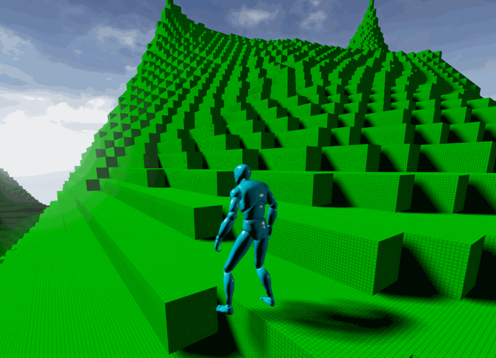
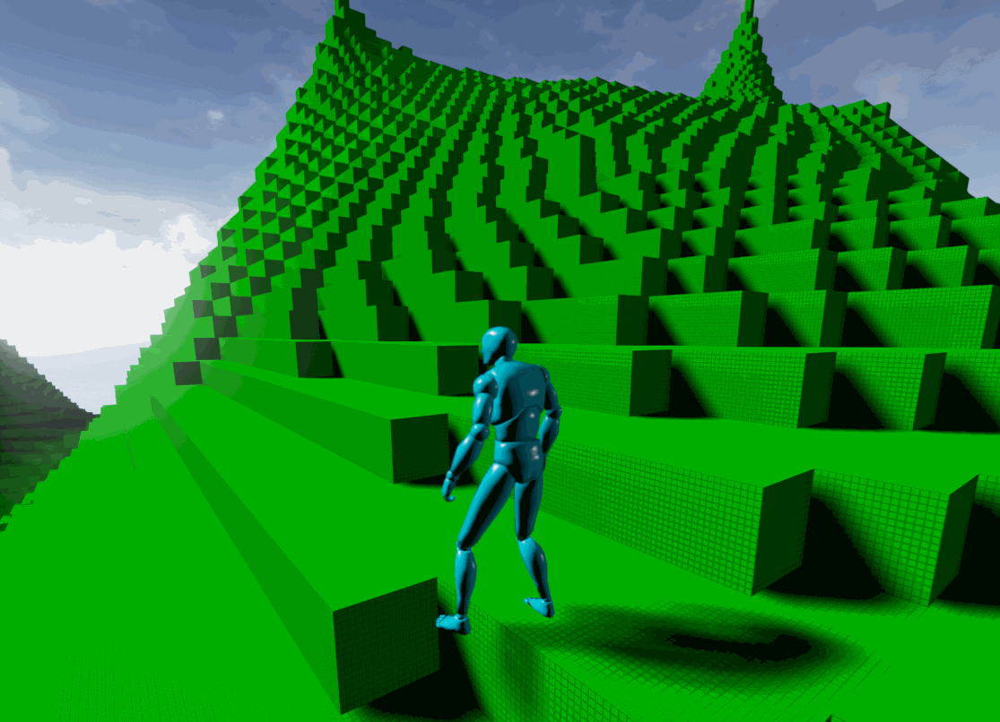
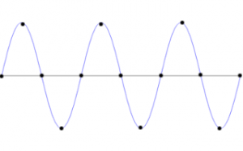
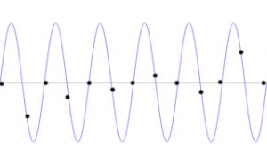
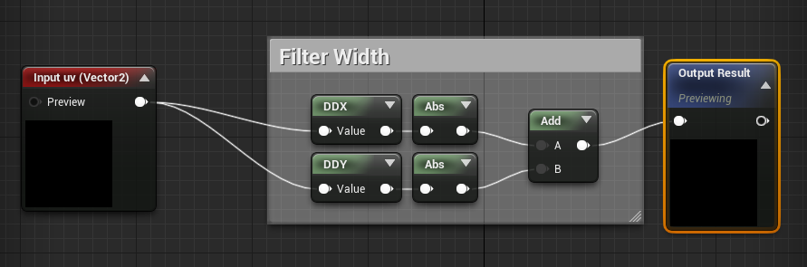
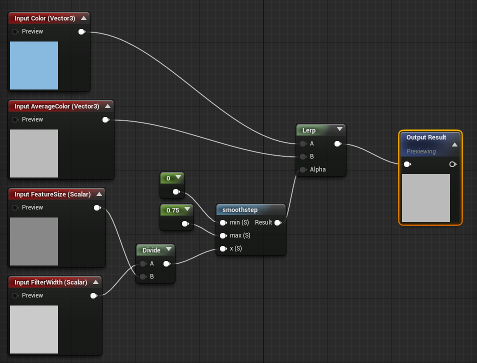
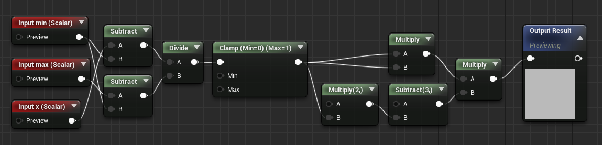
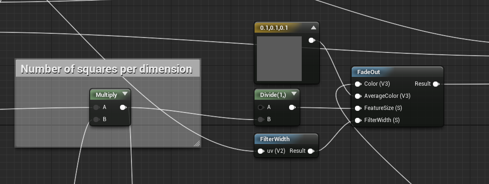

While working on procedural shaders in projects of my own I found that my shaders were producing undesired artifacts that I needed to 
get rid of.   In this post I'm going to explain how to produce the following results:

Before:

|  |
| :--: |

After:

|  |
| :--: |

(The sample rate is poor, so after doesn't look all that fantastic, but the major artifacts which I am trying to remove are gone)

### The Problem


Why the above artifacts are occurring is due to the sampling rate of the procedure as it gets further away from the camera.  Consider 
the following:

| |
| :--: |

If we are using the sine wave above to generate our result, when we are close to the camera, our 
[discrete sampling](https://en.wikipedia.org/wiki/Discrete-time_signal) rate will reproduce the wave nicely.  However, when our object
is far away from the camera, the frequency increases, but sampling rate remains the same:

|  |
| :--: |

The discrete sampling of the wave does not represent what is trying to be produced.  When this occurs, the shader has gone beyond the 
[Nyquist frequency](https://en.wikipedia.org/wiki/Nyquist_frequency), which states that when sampling the highest you can go is half 
that of the original sample.  Thankfully, we can detect this and solve the problem.

### The Solution

There are different ways to solve this problem, but the solution I'm going to focus on is frequency clamping.  When searching for a 
solution I wound up following the explanation from 
[A. Apodaca and L. Gritz, eds., "Advanced RenderMan: Beyond the Companion," SIGGRAPH '98 Course (course #11)](https://renderman.pixar.com/resources/RPS_14.0/prman_technical_rendering/AppNotes/appnote.25.html),
which the original can be found by following the link.

The process I am going to follow is:

1. Find the frequency of what I am generating

2. Find the filter width of the current object I am rendering

3. Figure out how much to fade between my desired result and an average result

### 1. Find the frequency of what I am generating

In my before and after pictures, I am generating an outline of a square over each face of my cube.  I am using the UV of the square face 
to determine this.  So, if I know that my UV is [0.0, 1.0] and that I want to repeat it 16 times per face, I can figure out my frequency 
as follows:

```
frequency = (length of uv)/(number  of squares)
```

or

```
frequency = 1.0/16
```

### 2. Find the filter width of the current object I am rendering

Before we can calculate the filter width, we need to know what it is. As defined in the paper linked above and in the Unreal Engine 
documentation, the filter width is the change of a value over its pixel position on the screen.  With this information we can make 
the decision if our shader can display a procedure correctly or if it reaches the Nyquist frequency. The Unreal Engine already has a 
function like this defined for 3D vectors (ComputeFilterWidth), but since UVs are 2D vectors, we can, as described in the cited paper 
above, calculate the filter width as follows:

```
filter width = max(|ddx(uv)| + |ddy(uv)|)
```

`ddx` is the change of the uv in the x direction on the screen and `ddy` is the change of the uv in the y direction on the screen.  For
objects that are close to the screen the uv will be changing slower where uvs that are further away from the screen will be changing 
faster.  Thankfully, the Unreal Engine provides us with these functions, so we can take advantage of them!

In the material editor you can make your own filter width function that looks like this:

|  |
| :--: |

### 3. Figure out how much to fade between my desired result and an average result

With these pieces of information we can finally have our shader make the decision to render our pattern or to render out an approximation
of what that pattern might look like from a distance.  At the moment, I'm just subtracting `vec3(0.2, 0.2, 0.2)` from my color to make the 
square pattern, so I'm going to use that in this example.  In the paper cited, there is a function called FadeOut, which figures out 
which color to use depending on the filter width.  In code it would look like the following:

```
color = lerp((amount of color to subtract), (average color to subtract), smoothstep((minimum value), (maximum value), (frequency/(filter width)));
```

in Unreal, this would look like:

|  |
| :--: |

What is happening here is the shader is [interpolating](https://en.wikipedia.org/wiki/Linear_interpolation) between the input color and 
the average color depending on result of [smoothstep](https://en.wikipedia.org/wiki/Smoothstep). Sometimes when interpolating, you want 
to do so linearly, which is what lerp provides, but in this case it was recommended to use smoothstep which slowly interpolates when 
near 0.0 or 1.0 and quickly shifts the values in the middle range. When the value of filter width is small compared to the frequency 
(or in the screen shot feature size) the color provided from the square pattern is used.  As the filter width gets larger, the shader 
starts to use the average color (which I defined at `vec3(0.1, 0.1, 0.1)` instead which gives the illusion that the squares are still
there in the distance, but in reality the color is just slightly dimmed.

Just for screenshot sake, here is what smoothstep looks like in the Material Editor:

|  |
| :--: |

In the end we this is what I had in my material:

|  |
| :--: |

where the result is subtracted from the green color to make the final effect.

While this implementation is in the Unreal Engine, I'm sure other other material editors or coding it by hand can follow the same steps.

Thanks to Larry Gritz for his amazing write up on this process and how it works.  Also, thanks to Max for his 
[sine wave generator](http://www.maxmcarter.com/sinewave/sinegen.html), which I used in this post.  
