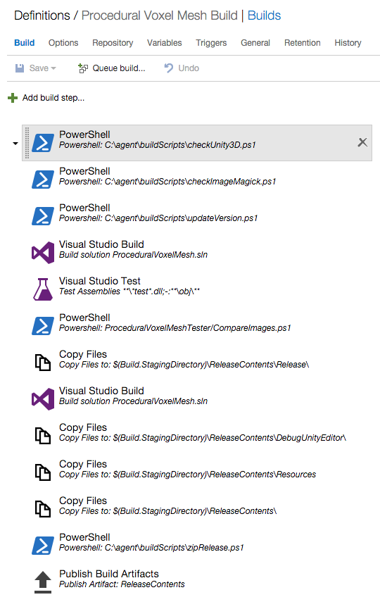
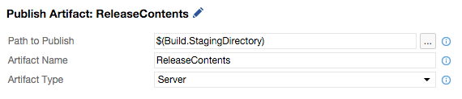
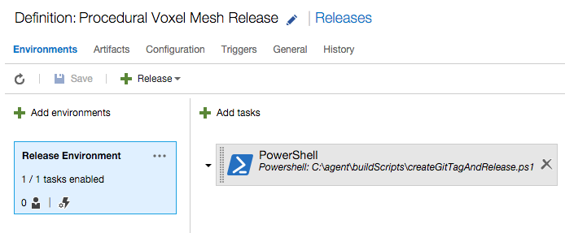
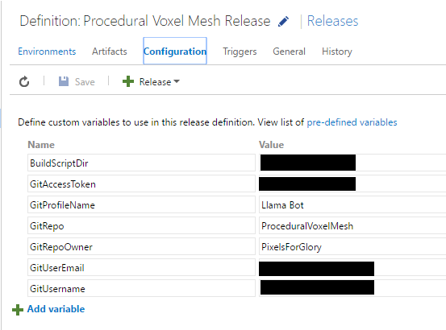
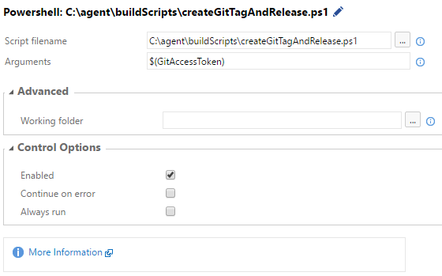
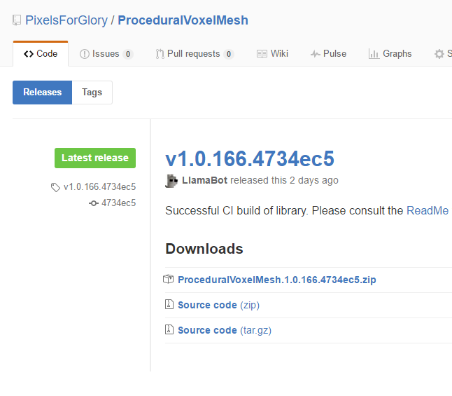

## Motivation

The primary motivation for making [GitHub][github], [Unity3D](http://unity3d.com/), and 
[Visual Studio Team Services][vsts] to play nice was to get a build status 
image to display on my repository's read me page:


I also wanted to be able to package successful builds of binaries so people could easily consume the latest version.  I was using 
[TeamCity](https://www.jetbrains.com/teamcity/) for a while on a server in my home, but I never wanted to expose it to the outside world.  This
lead to uploading build status images to GitHub, but, after finding Visual Studio Team Services, I wanted to try to have an external service host
manage the build and release process.

What follows is a summary of the workflow I came up with.  The assumption going forward is that the read is familiar with GitHub, Unity3D, and Visual Studio Team Services.

## Initial Setup

### GitHub

The following GitHub setup is completely optional, but, in my opinion, separating automated tasks to a service account will allow a user to easily separate his/her commits from the commits generated by automation.

On [GitHub][github]:

1. Create a service account.  This is just a normal user account that servers will use to access repositories.

2. From your personal account, create an [organization](https://help.github.com/articles/what-s-the-difference-between-user-and-organization-accounts/).
   This will make your personal account the owner of the organization and allow you to manage your organization from it.

3. Add your personal account and the service account that was just created to the organization and grant service account all access.
* This allows both your personal account and your service account to have full access to repositories


### Visual Studio Team Service

The Visual Studio Team Service will serve as the manager for the build and release process for your repository.  

On [Visual Studio Team Services][vsts]:

1. Create a [Visual Studio Team Service](https://www.visualstudio.com/products/visual-studio-team-services-vs) account.

2. Add a service endpoint to GitHub authorized with the service account.  The path to add an endpoint is located at:

   `Control Panel -> DefaultCollection -> [TEAM PROJECT] -> Services` 
   
   The control panel is accessed through the "Manage Settings" cog on any of the team project pages. 

### Build Agent

The following will require a virtual machine hosted on a local server or in the cloud.  I personally chose to host my build agent locally, but a cloud service should be able to do the same thing if a local server isn't available.  We are going to need to setup a custom build agent so we can build our Unity3D library.  The Microsoft supplied Hosted agent only builds with the libraries installed on it which unfortunately does not include Unity3D.

1. Install [Visual Studio](https://www.visualstudio.com/en-us/products/visual-studio-community-vs.aspx).  This is required to install the agent.
* When Visual Studio is not installed the error "The process cannot access the file because it is being used by another process" will occur.

2. Create an "Administrator" user account.  This account will run the build agent service.  
* In this setup the build account will also install/uninstall dependencies that will require administrator access.

3. Install Windows build agent. [MSDN Documentation](https://msdn.microsoft.com/en-us/library/vs/alm/build/agents/windows) has step by step instructions.  Make sure to use the new Administrator account as the build agent user.
   
## Build Definition

The following steps utilize build scripts I have posted to my [CIBuildScripts](https://github.com/afuzzyllama/CIBuildScripts) repository.  They are free for you to use and change at your own risk.  Some of the scripts I reference require user defined variables to be setup in the build.  Please make sure to define them or else the scripts will fail.

If Visual Studio Team Services and the Build Agent are setup correctly, creating a new build definition should be pretty straight forward.  I used the "Visual Studio" build template as a starting point.  Then a selected a GitHub repository source and selected "Continuous integration".  At this point don't forget to set the default agent queue to the one that includes your custom build agent.  

This is the build process I use for the [Procedural Voxel Mesh](https://github.com/PixelsForGlory/ProceduralVoxelMesh) library.  I'll break down each step below.   

 |  |
 | :--: |

### Check dependencies

The following might not be the proper way to define [demands](https://msdn.microsoft.com/en-us/library/vs/alm/build/define/general) for a build, but I want to make sure that I'm testing against the latest versions of Unity3D and other dependencies my build might have.  

The [`checkUnity3D.ps1`](https://github.com/afuzzyllama/CIBuildScripts/blob/master/checkUnity3D.ps1) script makes sure that the most recent version of Unity3D is installed on the build agent. It pings the Unity3D website to see what the current version is and if it is different it will uninstall the old version and download and install the new one.  Installing the editor alone will only make web builds work in the editor, so make sure you download the build support you need.  The script does this for Windows build support only, but could be modified for other build support as well.

When I run certain tests, I use [Image Magick](http://www.imagemagick.org/) to compare screenshots. So the 
[`checkImageMagick.ps1`](https://github.com/afuzzyllama/CIBuildScripts/blob/master/checkImageMagick.ps1) does the same thing as the `checkUnity3D.ps1` script.  An example of how I compare screenshots can be seen in the
[`CompareImages.ps1`](https://github.com/PixelsForGlory/ProceduralVoxelMesh/blob/master/ProceduralVoxelMeshTester/CompareImages.ps1) script in the Procedural Voxel Mesh repository.

### Set the build version

The process I use to update the build version is very crude and I'm not sure I can totally recommend it for serious build environments. While trying to figure out the right way to do this, I stumbled upon [MS Build Community Tasks](https://github.com/loresoft/msbuildtasks).  I didn't want to add another dependency to my process, but it might be worth checking out.

The [`updateVersion.ps1`](https://github.com/afuzzyllama/CIBuildScripts/blob/master/updateVersion.ps1) script figures out the version to apply to the build being attempted.  It takes the major version and the minor version which should be manually defined in `AssemblyInfo.cs` and then adds the build id and the source version to them.  An assembly version will look like `1.0.123` and the assembly informational version will look like `1.0.123.a1b2c3d`.  

### Build and test

The setup for the build and test tasks are pretty straight forward.  The way I setup my project, it looks for the Unity3D dlls from a set reference path. So to do a Release build and to set the reference path to the dependencies directory, I add the following MSBuild Arguments to this step:

```
/p:ReferencePath="$(Agent.RootDirectory)\dependencies\Unity\latest\Unity\Editor\Data\Managed" /p:Configuration=Release
```

I also created a test project that generates screenshots to compare against human validated screenshots with the `CompareImages.ps1` script.  

The other build step creates an editor specific library to be included in the release.

### Copy files for release

If everything up to this point has passed, we are ready to get our release together for deployment. The script 
[`zipRelease.ps1`](https://github.com/afuzzyllama/CIBuildScripts/blob/master/zipRelease.ps1) will create a zip file from the directory contents of "ReleaseContents" in the staging folder for the build agent.  I just copy whatever files I need with the "Copy Files" and then call the zip script last to generate the zip file. 

### Publish build artifacts

To create a release with the release management part of Visual Studio Team Services, we must publish artifacts for it to release.  The setup is pretty simple:

|  |
| :--: |


### Display build badge

At this point, I can display the build badge from the build.  To do this, go to your definition's "General" tab and enable the badge.  Now post it so everyone can see the success of your hard work!

## Release Definition

After a successful build is complete, the release manager can help us get our binaries to GitHub. The following steps utilize build scripts I have posted to my [CIBuildScripts](https://github.com/afuzzyllama/CIBuildScripts) repository.  They are free for you to use and change at your own risk. Some of the scripts I reference require user defined variables to be setup in the build.  Please make sure to define them or else the scripts will fail.

Under the "Release" section, I used the empty release definition as a starting point.  To correctly link your build to the release, I suggest reviewing the documentation at MSDN on 
[Release definitions](https://msdn.microsoft.com/en-us/library/vs/alm/release/author-release-definition/more-release-definition).  

After the artifacts are linked and the environment is setup there is only one task I setup for the release process for the [Procedural Voxel Mesh](https://github.com/PixelsForGlory/ProceduralVoxelMesh) library:

|  |
| :--: |

### Creating a GitHub release 

Before I start explaining what the script does, I wanted to point out the configuration screens for the release.

First the release configuration:

|  |
| :--: |

I wanted to supply as much information as possible to the script to communicate efficiently to GitHub through the API. The following user defined variables are defined:

* GitAccessToken - This is an access token that I generated specifically for this release manager.  I clicked the lock to the right of the variable definition to make it secret.  This will be visited again in the next section.
* GitProfileName - When generating a tag for a release, this is the name that will be displayed in the tag.
* GitRepo - The repository being released to.
* GitRepoOwner - The owner of the repository being released to.  In this case, it is an organization and not a user account.
* GitUserEmail - When generating a tag for a release, this is the email that will be displayed in the tag.
* GitUserName - The username of the account that will be interacting with the API.  This is set to the username of my service account.

The options for `createGitTagAndRelease.ps1`:

|  |
| :--: |

I wanted to point out that in the arguments that I pass `$(GitAccessToken)`.  This is because when I define my access token, it is secret and is not placed in the environment variables for the build.  Passing it in this way will put it in the `args[0]` variable in the script and allow us to use it to authenticate with GitHub.

Finally, the process of the [`createGitTagAndRelease.ps1`](https://github.com/afuzzyllama/CIBuildScripts/blob/master/createGitTagAndRelease.ps1) is pretty standard when it comes to creating a release on GitHub.  Here are the steps it takes to create a release:

1. Create a [tag](https://developer.github.com/v3/git/tags/#create-a-tag-object) on GitHub.
2. Create a [reference](https://developer.github.com/v3/git/refs/#create-a-reference) which creates an [annotated tag](https://git-scm.com/book/en/v2/Git-Basics-Tagging#Annotated-Tags) in the repository.
3. Make the newly created tag a [release](https://help.github.com/articles/creating-releases/)
4. Upload any assets to the release.  In the case of my workflow, I upload the zip created in the build process.

After all is said and done, a release should appear on GitHub:

|  |
| :--: |

I hope with what I have shared you too might be able to use continuous integration with your projects.  If you have any questions or comments, feel free to contact me via twitter.  

Enjoy!

[github]: https://github.com/
[vsts]: https://www.visualstudio.com/en-us/products/visual-studio-team-services-vs.aspx

