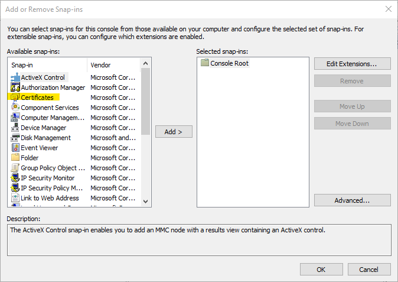
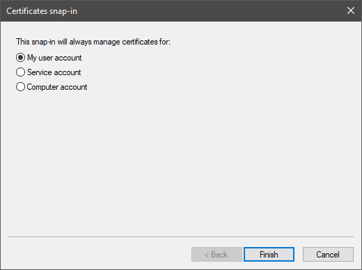
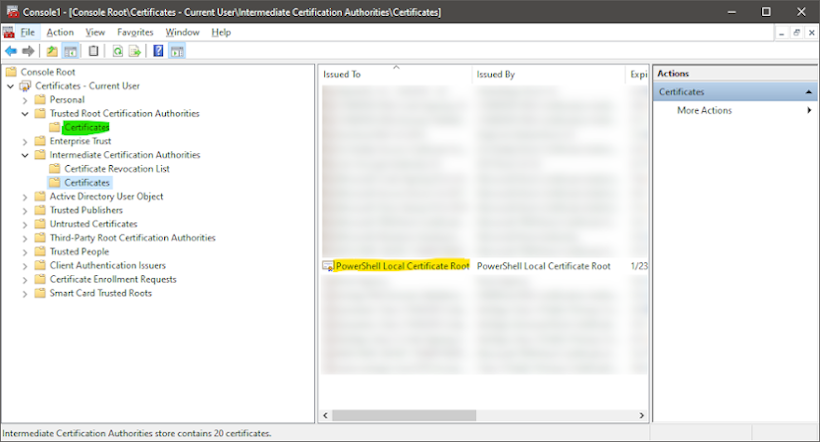
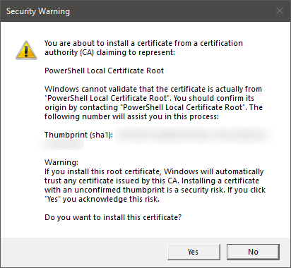

While setting up my laptop, I was running into issues getting my powershell profile to execute when I opened a window.  

{data-language=console}
```
. : File C:\Users\afuzzyllama\Documents\WindowsPowerShell\Microsoft.PowerShell_profile.ps1 cannot be loaded.  The file C:\Users\afuzzyllama\Documents\WindowsPowerShell\Microsoft.PowerShell_profile.ps1 is not digitally signed. You cannot run this script on the current system. For more information about running scripts and setting execution policy, see about_Execution_Policies at https:/go.microsoft.com/fwlink/?LinkID=135170.
At line:1 char:3
+ . 'C:\Users\afuzzyllama\Documents\WindowsPowerShell\Microsoft.PowerShell_profile.ps1
+   ~~~~~~~~~~~~~~~~~~~~~~~~~~~~~~~~~~~~~~~~~~~~~~~~~~~~~~~~~~~~~~~~~~~
    + CategoryInfo          : SecurityError: (:) [], PSSecurityException
    + FullyQualifiedErrorId : UnauthorizedAccess
```

Looking around, I found that [some developers online](https://superuser.com/questions/1268727/powershell-profile-does-not-load) were suggesting to circumvent the security by allowing all scripts:

{data-language=powershell}
```
> Set-ExecutionPolicy Unrestricted
```

or limiting downloaded scripts from not being able to run, but running local scripts unrestricted:

{data-language=powershell}
```
> Set-ExecutionPolicy RemoteSigned
```

This did not sit well with me and after reading Scott Hanselman's [blog post](https://www.hanselman.com/blog/SigningPowerShellScripts.aspx) on this topic. I decided to give self-signing my profile a go. Finding that his post is a little outdated at the time I am writing this, here are the steps I took to self-sign my own profile.ps1:

1. **Create a self-signed certification with [New-SelfSignedCertificate](https://docs.microsoft.com/en-us/powershell/module/pkiclient/new-selfsignedcertificate).  Here is what I specifically ran:**

{data-language=powershell}
```
> New-SelfSignedCertificate 
    -Type CodeSigningCert 
    -Subject "CN=PowerShell Local Certificate Root" 
    -CertStoreLocation "Cert:\CurrentUser\My" -NotAfter (Get-Date).AddYears(99)    
```

* Just to cover a few things:

    * **-Type CodeSigningCert** - this certificate will only be used to sign code
    * **-Subject "CN=PowerShell Local Certificate Root"** - this is the name of the certificate (we'll see this later)
    * **-CertStoreLocation "Cert:\CurrentUser\My"** - this certificate will be stored for the current user (so no other users can use this certificate to sign)
    * **-NotAfter (Get-Date).AddYears(99)** - this basically makes the certificate never expire since I will most likely not be developing or developing on this machine in 99 years

    We can check that the certification was made by running the following.  The output should look similar to below (except the Thumbprint should not be all Xs :smile:):

{data-language=powershell}
```
> Get-ChildItem Cert:\CurrentUser\My

PSParentPath: Microsoft.PowerShell.Security\Certificate::CurrentUser\My

Thumbprint                                Subject
----------                                -------
XXXXXXXXXXXXXXXXXXXXXXXXXXXXXXXXXXXXXXXX  CN=PowerShell Local Certificate Root
```
   
2. **Open MMC and make the self-signed certificate**

    Follow below to get a sign-signed certificate installed on the machine.

    1. Open "Run" and type "mmc" to open the Microsoft Management Console
    2. "File" => "Add/Remove Snap in" and add the Certificates snap-in:  
    
    3. Add the snap in to only manage "My user account":  
    
    4. Locate the self-signed certificate under Console Root => Intermediate Certification Authorities => Certificates (highlighted in yellow) and move it to Console Root => Trsuted Root Certification Authorities => Certificates
    

        The following pop-up will appear to confirm that the self-signed certification can be trusted. Click "Yes" to complete the move.  
        

3. **Sign Powershell profile**

* With our new certificate in place, we can now sign our profile with the following commands (assuming there is only one code signing certificate under "Cert:\CurrentUser\My"):

{data-language=powershell}
```
> $cert=Get-ChildItem -Path Cert:\CurrentUser\My -CodeSigningCert
> Set-AuthenticodeSignature -FilePath $profile -Certificate $cert
```
    
* If the signing is successful, the following should be displayed:  

[code]: # ({"Language":"console"})
    Directory: ~\Documents\WindowsPowerShell

    SignerCertificate                         Status          Path
    -----------------                         ------          ----
    XXXXXXXXXXXXXXXXXXXXXXXXXXXXXXXXXXXXXXXX  Valid           Microsoft.PowerShell_profile.ps1
    
With the profile now signed, when powershell is opened the error at the beginning of this post should no longer show.  Just remember, every time the profile is edited it needs to be re-signed.

Hope that helps! :tada:
